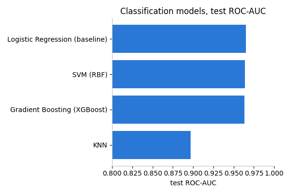
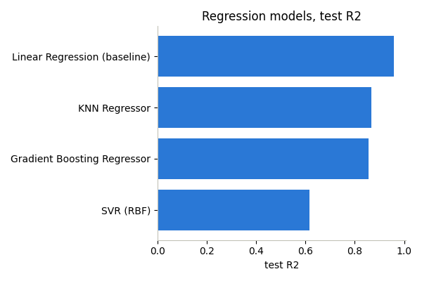
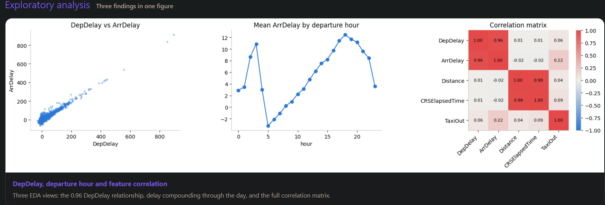
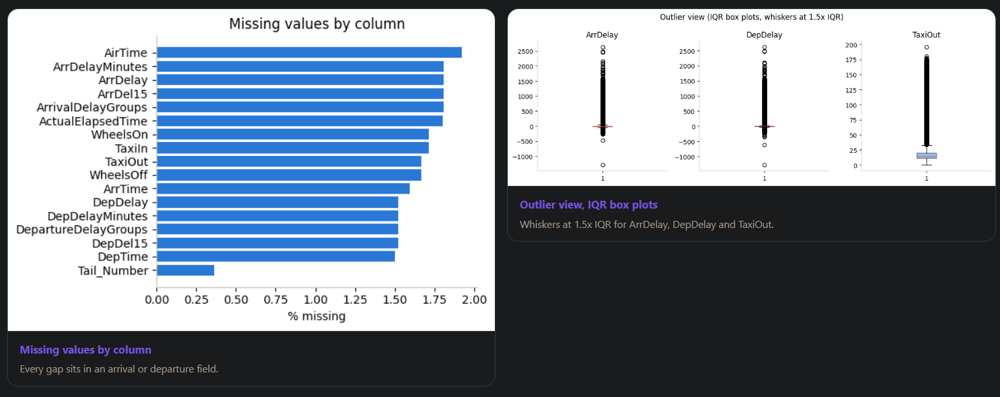
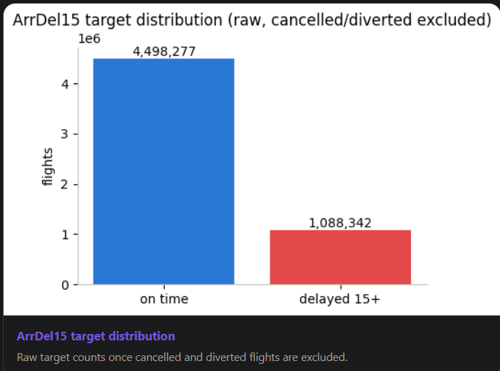

# Flight Delay Prediction

A tool that predicts how late a US domestic flight will land, right after it leaves the gate. Built for airlines and aviation regulators who need a fast, reliable estimate of arrival delay to support operations, passenger updates, and connection planning.

## What it does

The model uses information available the moment a flight leaves the gate, such as airline, route, day, and ground delay so far, to predict:

- Whether the flight will land 15 minutes or more late
- How many minutes late the flight will land

On flights it has never seen before, it reaches a 96% ROC-AUC score, a standard accuracy measure for this type of prediction. That is well above what a simple schedule based estimate can achieve.

## Model performance

The plots below compare the classification and regression models on the held-out test set. Logistic Regression achieved the highest classification ROC-AUC at **0.965**, while Linear Regression achieved the highest regression R² at **0.958**.

## Why it matters for airlines and regulators

Once a flight leaves the gate, airlines and airports still mostly rely on the original schedule for arrival estimates. This model replaces that guess with a live, data backed prediction. In practice, that supports:

- Better passenger updates at the gate and for connecting flights
- Better ground crew and gate planning
- A clearer, measurable view of on time performance for regulators

## A gap this project found

This model only works after a flight has already departed. Predicting delay before departure, while the flight is still being scheduled, is a harder and more valuable problem, and this project found a real gap there.

Using only the data commonly tracked before departure (schedule, route, day, time), prediction accuracy tops out around 70%, far below the 96% reached after departure. Early work on this project shows that gap is a data problem, not a modeling problem. Signals like how much padding is built into a schedule, how congested a departure airport tends to be at a given hour, and how delay prone a specific route has been are rarely collected or used today, but they carry real predictive value.

For airlines and regulators, this points to a clear opportunity: collecting and using this kind of pre-departure data could close much of that gap, moving delay prediction from reactive (after departure) to proactive (before departure).

## What's in this repo

- `Capstone_ArrivalDelay.ipynb`: the full analysis, from data cleaning through modeling, evaluation, and final recommendations
- `demo/`: an interactive web app that shows the models and results live, and lets you test predictions yourself
- `Docs/`: the project brief, presentation deck, and summary report

## Try it

Visit `https://mlproject.khalid-ai.dev` for a live demo.

## Exploratory Data Analysis (EDA)

Exploratory Data Analysis was performed to understand the main patterns, relationships, missing values, outliers, and target distribution in the flight delay dataset.

### Exploratory Analysis

We analyzed the relationship between departure delay and arrival delay, the average arrival delay by departure hour, and correlations between key numerical features.

The analysis shows a strong relationship between `DepDelay` and `ArrDelay`, with a correlation of approximately **0.96**.

---

### Missing Values and Outliers

Missing values were analyzed across the dataset to identify columns that required preprocessing.

We also examined outliers in important numerical features such as `ArrDelay`, `DepDelay`, and `TaxiOut` using IQR-based box plots.

---

### Target Distribution

The `ArrDel15` target distribution was analyzed after excluding cancelled and diverted flights.

The dataset contains:

* **4,498,277** on-time flights
* **1,088,342** flights delayed by 15 minutes or more

This shows that the target classes are imbalanced, with significantly more on-time flights than delayed flights.

---

### Key EDA Findings

* Departure delay has a very strong relationship with arrival delay.
* Arrival delays tend to increase during later departure hours.
* Some numerical features show strong correlations with each other.
* Several arrival and departure-related columns contain missing values.
* Significant outliers exist in delay-related features.
* The target distribution is imbalanced, with on-time flights being the majority class.
